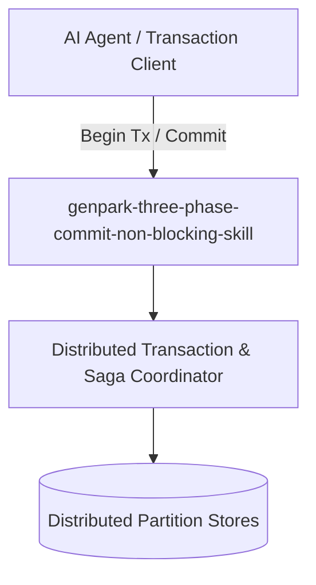

# genpark-three-phase-commit-non-blocking-skill

[](https://github.com/alphaparkinc/genpark-three-phase-commit-non-blocking-skill/actions)
[](https://opensource.org/licenses/MIT)
[](https://www.python.org/downloads/)

> Three-Phase Commit (3PC) non-blocking distributed atomic transaction protocol with CanCommit, PreCommit, and DoCommit phases.

## Architecture



## Features
- Pure standard library Python implementation with strictly zero pip dependencies.
- Production-grade transactional patterns (2PC, Saga compensations, TCC reservations, Percolator).
- Native Model Context Protocol (MCP) server support for AI agent distributed transactions.

## Installation

```bash
git clone https://github.com/alphaparkinc/genpark-three-phase-commit-non-blocking-skill.git
cd genpark-three-phase-commit-non-blocking-skill
```

## Quickstart

```bash
python example_usage.py
```
